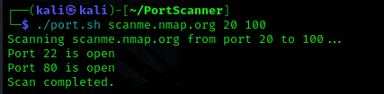

# 🔍 Bash Port Scanner

A simple Bash-based port scanner using `netcat (nc)` to scan open TCP ports on a target IP or hostname. Ideal for learning, basic security testing, and network diagnostics.

---

## ⚙️ Features

- Scans **all 65,535 TCP ports** or a specified range
- Supports **DNS resolution**
- Saves results to **timestamped log files**
- Displays results in reverse (open ports at the bottom)
- Easy to use and fast to run
- Can optionally push scan logs to a GitHub repo

---

